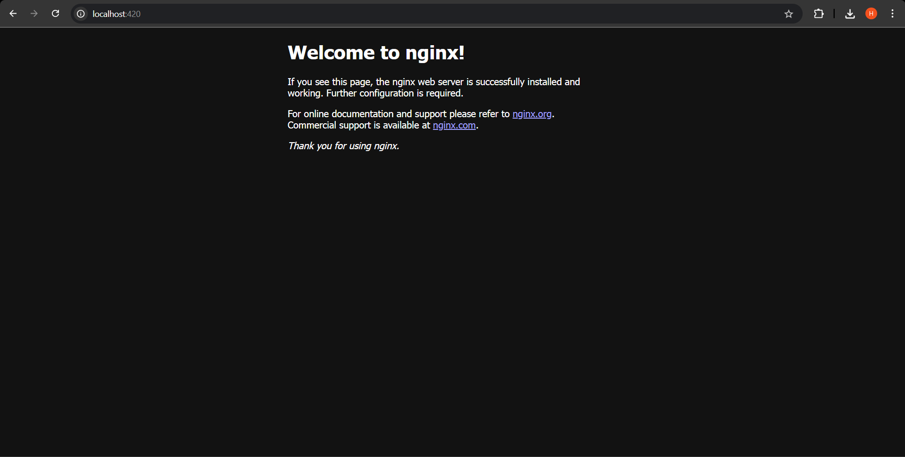

# Lab 4 - Processes and Services

## Part 1: Using systemd

#### Question 1: What is the name of a systemd service running on your system? What does it do?

systemd-logind.service

systemd-logind is a system service that manages user logins. 

#### Question 2: What is the difference between `systemctl reload yourservice` and `systemctl restart yourservice`?

- restart = stop + start
- reload = remain running + re-read configuration files.

#### Question 3: Upload a screenshot of your browser accessing the nginx webserver at http://[yourusername].decal.ocfhosted.com:420. Note: If you can’t access the IPv6 site use curl localhost:420 on the VM and paste it’s contents (it should be a html page).

start nginx (via `sudo systemctl start nginx`) then go to the command line and write `curl localhost:420`



#### Question 4: What command did you run to crash the service?

`curl -X POST http://localhost:5000/crash -H 'Content-Type: application/json' -d '{"crash":"true"}'`

`-X` specify request type (e.g. POST)

`-H` specify request header

`-d` specify payload

#### Question 5: Upload your fully featured toy.service file

```bash
[Unit]
Description=Web server management service of a Flask app
After=network.target

[Install]
WantedBy=multi-user.target

[Service]
ExecStart=/bin/bash /home/hshs-dev/SysadminDeCal/Lab4/4/run
User=hshs-dev
Restart=always
RestartSec=10
```

## Part2: Processes

#### Why do you think this behavior occurs (hint: TTY column)?

A TTY is a computer terminal. In the context of ps, it is the terminal that executed a particular command.

The abbreviation stands for "TeleTYpewriter", which were devices that allowed users to connect to early computers.

so each terminal is seperate in its processes