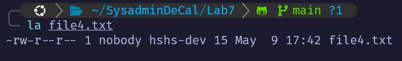

# Lab 7 - Security Fundamentals

- Decrypt file1.txt.gpg with the password ocfdecal (for real-life purposes, never store passwords in plaintext). What are the decrypted contents of file1.txt.gpg?

`Quack`

***

- What command allows you to import a key?

```bash
gpg import [FILE] 
```

where file contains the key

***

- What command allows you to export a key to a file? (Add the --armor flag to ASCII-encode the key so it can be sent easily in text form)

```bash
gpg --armor --output alic.asc --export alice@cyb.org
```

***

- What command allows you to see all of the keys on your keyring?

```bash
gpg --list-keys
```

***

- Use the private key lab7privkey to decrypt the file file2.txt.gpg (for real-life purposes, it is necessary to keep private keys secret). What are the decrypted contents of b8/file2.txt.gpg?

First import the private key `lab7privkey` using the following command:

```bash
gpg --import lab7privkey
```

`Woof`

***

- What is the MD5 hash of file3.txt?

`ddbefc9c1d8a8d9195a420a7181352e9`

***

- What is the SHA1 hash of the MD5 hash of file3.txt? In other words, what is SHA1(MD5(file3.txt))?

`eda05a705bfe77e5d4cbab81c358cdbcc18b8b4a`

***

- `file4.txt`: What are the permissions of this file? Explain what they allow and disallow.



owner of the file: read and write only

owner group: read only

anyone else: read only

***

- `file5`: Make this file executable and execute it. What is its printout?

`aching flair`

***

- `file6.txt`: Change this file to be under your ownership. What command did you use?

```bash
sudo chown hshs-dev:hshs-dev file6.txt
```

***

- `file7.txt`: Make this file readable only to you. What command did you use?

```bash
sudo chmod g+r file7.txt
```

***

- `file8.txt`: Change this file’s permissions such that only root should be able to read this file and no one should be able to edit it. What command did you use?

```bash
sudo chmod 455 file8.txt
```

| Number | Symbol | Permissions     | Description                      |
| ------ | ------ | --------------- | -------------------------------- |
| 0      | ---    | No permission   | Cannot read, write, or execute   |
| 1      | --x    | Execute only    | Can run the file (if executable) |
| 2      | -w-    | Write only      | Can modify the file              |
| 3      | -wx    | Write & execute | Modify and run                   |
| 4      | r--    | Read only       | Can view contents                |
| 5      | r-x    | Read & execute  | View and run                     |
| 6      | rw-    | Read & write    | View and modify                  |
| 7      | rwx    | All permissions | Full control                     |

***

- `file9.txt`: Choose any method to make this file readable to you and unreadable to the previous owner. What command did you use?

```bash
chmod 343 file9.txt
```
